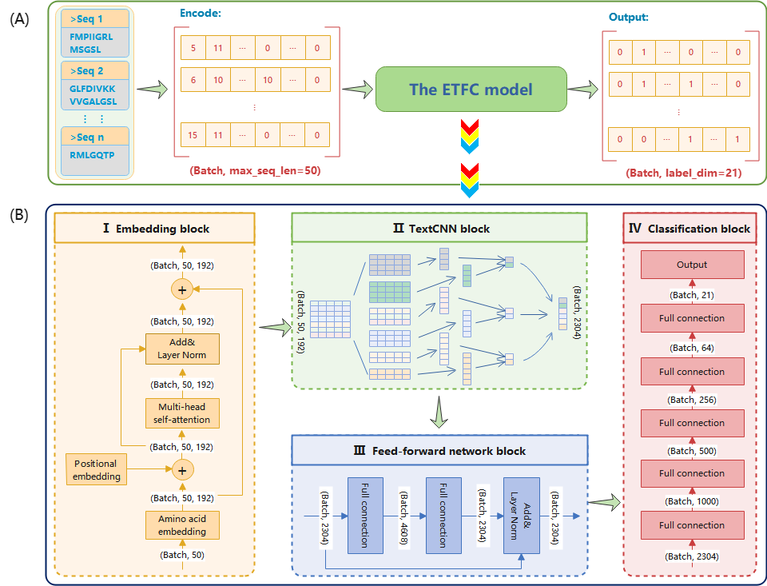
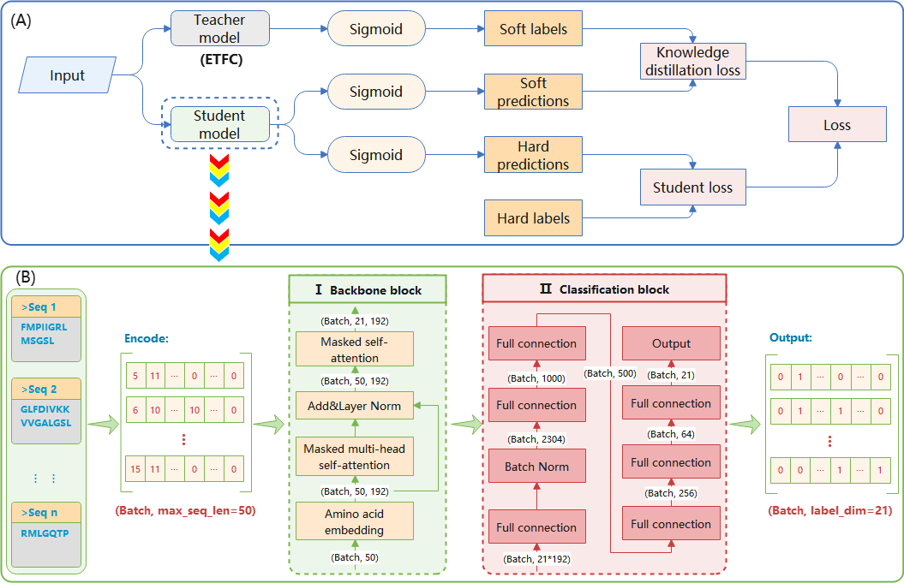

# ETFC
Deep learning-based multi-functional therapeutic peptides prediction with a multi-label focal dice loss function

## Introduction
In this paper, we develop a novel deep neural network-based MLC model named ETFC to predict MFPTs. This work has the following advantages over existing methods:  
(1) In the ETFC model, semantic-based and position-based embedding block combined with MHSA can capture more peptide sequence information, and text convolutional neural network (TextCNN) could extract the more effective information from peptide sequence.  
(2) To handle the imbalance problem in the MLC dataset, we design a novel loss function, termed multi-label focal dice loss (MLFDL), for MLC based on FL and dice loss (DL). MLFDL can dynamically assign weights to labels by exploiting label correlations to improve the prediction performance.   
(3) We use the teacher-student-based knowledge distillation to obtain the importance of AA and quantify their contributions towards each of the investigated activities.  

The framework of the ETFC method for MFTP prediction is described as follows:

  
The teacher-student framework for knowledge distillation is exhibited as follows:  



## Related Files

#### ETFC

| FILE NAME         | DESCRIPTION                                                                             |
|:------------------|:----------------------------------------------------------------------------------------|
| main.py           | the main file of ETFC predictor (include data reading, encoding, and data partitioning) |
| KD_main.py        | the main file of knowledge distillation                                                 |
| train.py          | train model                                                                             |
| model.py          | model construction                                                                      |
| util.py           | utils used to build models                                                              |
| loss_functions.py | loss functions used to train models                                                     |
| evaluation.py     | evaluation metrics (for evaluating prediction results)                                  |
| dataset           | data                                                                                    |
| result            | Models and results preserved during training.                                           |
| Figs              | Saved figures                                                                           |


## Installation
- Requirement
  
  OS：
  
  - `Windows` ：Windows10 or later
  
  - `Linux`：Ubuntu 16.04 LTS or later
  
  Python：
  
  - `Python` >= 3.6
  
- Download `ETFC`to your computer

  ```bash
  git clone https://github.com/xialab-ahu/ETFC.git
  ```

- open the dir and install `requirement.txt` with `pip`

  ```
  cd ETFC
  pip install -r requirement.txt
  ```
  
## Training and test ETFC model
```shell
cd "./ETFC/ETFC"
python main.py
```

## Run ETFC on a new test fasta file
```shell
python predictor.py --file test.fasta --out_path result
```

- `--file` : input the test file with fasta format

- `--out_path`: the output path of the predicted results


## Contact
Please feel free to contact us if you need any help.

